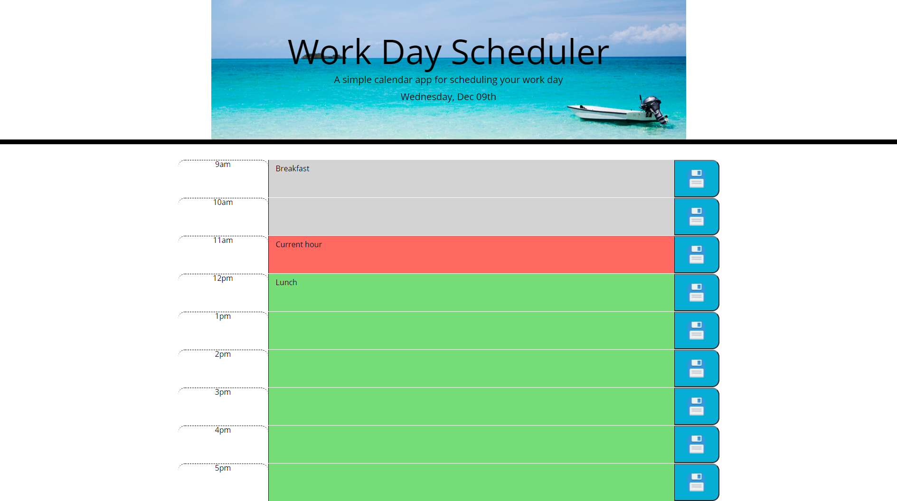

# workDayScheduler

#### By John Toth

## Description

This project demonstrates utilizing a library to deal with date and timestamps to display a daily planner.  This daily planner also demonstrates the use
of dynamically updated HTML and CSS.    jQuery was utilized in this project.

The daily planner displays a 1-day calendar with time blocks for working hours between 9AM and 5PM.  A user is able to enter events into each time block and save those events by clicking the respective Save buttons.

In addition, the time blocks are colorized to indicate events that are in the past based upon current time, events that are during the current hour and events that are stil in the future.  

All the events saved are held in local storage of the web browser such that they are re-displayed whenever appliation is opened or browser is refreshed.  An extra feature of the project is that as each new day occurs the previous days events are cleared so that user has a blank slate the first time application is run on a new day.

## Screenshot

The following is a screenshot of the daily planner.

  

## Setup/Installation Requirements

Direct link to repository:  https://github.com/jtoth7824/workDayScheduler

Direct link to Javascript Quiz webpage:  https://jtoth7824.github.io/workDayScheduler/

## Support and contact details

Please email me for further questions at jtoth7824@gmail.com

## Technologies Used

jQuery

day js library

Javascript

Local Storage

HTML

CSS

Bootstrap components
